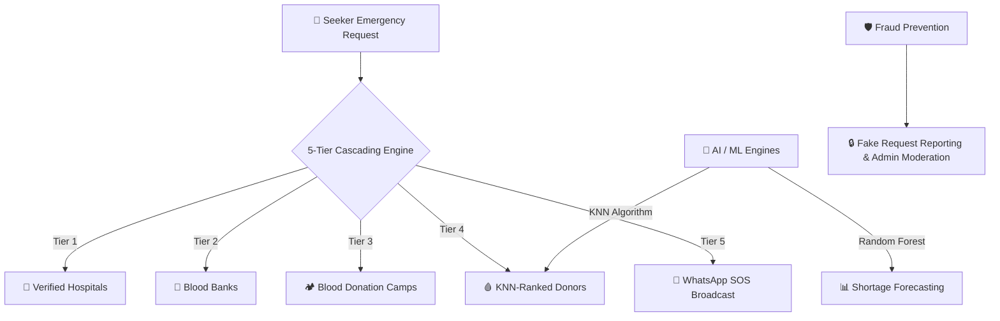

<div align="center"> 

# 🩸 BloodSetu

### **Smart Blood Network Portal — All Gujarat**

*Connect Blood. Save Lives.*

[](https://www.python.org/)[](https://streamlit.io/)[](https://scikit-learn.org/)[](https://plotly.com/)[](https://www.sqlite.org/)[](https://opensource.org/licenses/MIT)

[](https://git.io/typing-svg)

</div>

---

## 🌟 Overview

**BloodSetu** is an advanced, AI-powered smart blood network portal designed to bridge the critical gap between blood seekers, hospitals, blood banks, emergency camps, and voluntary donors across **Gujarat**. Built as a comprehensive full-stack data science and web application, BloodSetu eliminates bureaucratic delays in life-or-death emergency scenarios through instant **Zero-Login Seeker Access** and a revolutionary **5-Tier Cascading Emergency Search Engine**.

Developed as **Mini Project-II (Python with AI, ML, DS) for BCA (Hons) at Parul University**, BloodSetu combines modern dark glassmorphism UI design, geospatial mapping via Folium, machine learning predictive modeling (Random Forest & KNN), and robust fraud prevention mechanisms into a cohesive, production-ready platform.

---

## ✨ Key Features & Architecture



### 1. ⚡ The 5-Tier Cascading Emergency Search

In critical medical emergencies, every second counts. BloodSetu provides an intelligent cascading search that automatically escalates through five distinct provider tiers until a viable blood match is secured:

- **Tier 1 (Hospitals):** Instant query of verified hospital blood inventories across Gujarat cities.

- **Tier 2 (Blood Banks):** Live stock levels and unit availability from licensed regional blood banks.

- **Tier 3 (Camps):** Active community blood donation drives and camps currently operating.

- **Tier 4 (Emergency Donors):** AI-ranked voluntary donors filtered by blood group, city, area distance, and 90-day WHO recovery eligibility.

- **Tier 5 (WhatsApp SOS):** Instant one-click preformatted emergency broadcast generation for community WhatsApp groups when local inventories are depleted.

### 2. 🧠 Artificial Intelligence & Machine Learning

- **KNN (K-Nearest Neighbors) Donor Matching:** Ranks available voluntary donors using a multi-metric distance proxy (city/area spatial proximity) combined with donation experience scores, ensuring the nearest and most reliable donors are contacted first.

- **Random Forest Shortage Forecasting:** Analyzes historical request patterns, seasonal blood group demand, and donor turnout to forecast monthly blood shortages across Gujarat, enabling proactive blood camp mobilization.

### 3. 🛡️ Fraud Prevention & Governance

- **Seeker Verification Gate:** Prevents prank calls and spam by requiring seeker verification before exposing direct donor contact numbers.

- **Fake Request Reporting:** Providers can report fraudulent or incorrect seeker details with specific reasons (wrong number, prank request, duplicate).

- **Admin Moderation & Appeal Workflow:** Admins can review flagged phone numbers, restrict malicious accounts, and provide transparent appeal pathways.

### 4. 👥 Multi-Role Portals

- **Seeker Portal:** Zero-login, ultra-fast emergency blood search with interactive maps.

- **Donor Portal:** Profile management, 90-day recovery tracking, slot booking at hospitals/camps, life-saved metrics, and appreciation badges.

- **Hospital & Blood Bank Portals:** Inventory management with stale-data warnings, donor slot verification, donation confirmation (automatically triggering the donor's 90-day countdown), and WhatsApp event broadcasting.

- **Blood Camp Portal:** Organizer registration, automated camp date expiry, RSVP tracking, and slot coordination.

- **Admin Panel:** Central governance dashboard for verifying institutional accounts, reviewing fraud reports, and monitoring platform telemetry.

---

## 🎨 UI & Design Highlights

BloodSetu features a bespoke **Dark Glassmorphism UI** (`#1a0505` background with crimson `#c0392b` and gold `#f0c040` accents) crafted with Google Fonts (**Playfair Display** & **Poppins**), custom SVG mascots, and embedded Lottie animations.

| Component | Design Element | Purpose |
| --- | --- | --- |
| **Hero Section** | Animated Typing SVG & Pulse Badges | Immediate visual engagement and live status indication |
| **Navigation** | Glassmorphic Sidebar with Active Glow | Seamless role switching across 11 dedicated portals |
| **Maps** | Interactive Folium Dark Tiles (`cartodark`) | Precise geospatial visualization of hospitals, banks, and camps |
| **Analytics** | Plotly Interactive Dashboards | Real-time visual representation of blood group distributions and AI forecasts |

---

## 🛠️ Tech Stack

- **Frontend & UI:** Streamlit 1.32+, Custom CSS (Dark Glassmorphism), Streamlit-Lottie, Streamlit-Folium

- **Data Science & ML:** Python 3.11+, Pandas, NumPy, Scikit-Learn (KNeighborsClassifier, RandomForestClassifier)

- **Geospatial & Visualization:** Folium, Plotly

- **Database & Persistence:** SQLite3 with structured relational schema (9 core tables)

- **Authentication & State:** Streamlit Session State with secure role-based session management

---

## 📁 Repository Structure

```
bloodsetu/
├── app.py                  # Main Streamlit entry point & router
├── auth.py                 # Authentication & session state manager
├── database.py             # SQLite schema initialization & CRUD operations
├── fraud.py                # Fraud reporting & moderation system
├── map_handler.py          # Folium geospatial map builder
├── ml_model.py             # KNN donor ranking & Random Forest shortage forecasting
├── utils.py                # Gujarat cities/areas taxonomy & blood compatibility logic
├── requirements.txt        # Python package dependencies
├── assets/
│   ├── styles.css          # Custom dark glassmorphism stylesheet
│   └── lottie/             # Lottie animations (blood drop, heartbeat, confetti, siren)
├── data/
│   ├── areas_gujarat.csv   # Gujarat city area taxonomy
│   ├── blood_banks_gujarat.csv # Seed data for blood banks
│   ├── donors.csv          # Seed data for voluntary donors
│   └── hospitals_gujarat.csv # Seed data for hospitals
└── pages/
    ├── home.py             # Homepage & 5-tier search overview
    ├── find_blood.py       # Core cascading emergency search workflow
    ├── eligibility.py      # WHO 90-day donor eligibility checker
    ├── analytics.py        # AI/ML forecasts & platform metrics
    ├── daata_wall.py       # Leaderboard & appreciation wall
    ├── donor.py            # Donor portal & slot booking
    ├── hospital.py         # Hospital inventory & slot verification
    ├── blood_bank.py       # Blood bank stock & drive management
    ├── camp.py             # Blood camp organizer portal
    └── admin.py            # Admin governance & moderation panel
```

---

## 🚀 Getting Started Locally

### Prerequisites

Make sure you have **Python 3.11+** installed on your system.

### 1. Clone the Repository

```bash
git clone https://github.com/dhararaulji666-del/bloodsetu.git
cd bloodsetu
```

### 2. Create a Virtual Environment (Recommended )

```bash
python3 -m venv venv
source venv/bin/activate  # On Windows use: venv\Scripts\activate
```

### 3. Install Dependencies

```bash
pip install -r requirements.txt
```

### 4. Run the Application

```bash
streamlit run app.py
```

Open your browser and navigate to `http://localhost:8501` to experience BloodSetu!

---

## 🎓 Academic Context

- **Project Title:** BloodSetu (Smart Blood Network Portal — All Gujarat )

- **Course:** BCA (Hons) — Mini Project-II (Python with AI, ML, DS)

- **Institution:** Parul University

- **Developer:** [Dhara Raulji](https://github.com/dhararaulji666-del)

---

## 📜 License

Distributed under the **MIT License**. See `LICENSE` for more information.

<div align="center">
<p><i>Made with ❤️ and Python to save lives across Gujarat.</i></p>
</div>
